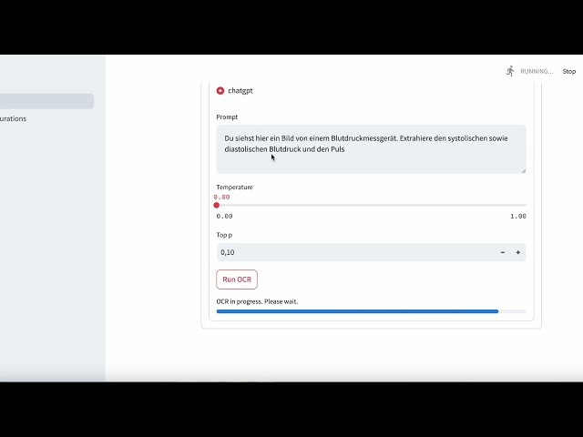

# AI-Optical-Character-Recognition (AI-OCR): Extracting data from images


This repository is the backend code for a tool with which you can extract data from images using visual LLMs.
The frontend code (using streamlit) can be found here: [AI-OCR-Frotend](https://github.com/jWinman91/AI-OCR-Frontend).

## Table of Contents

- [Installation](#Installation)
- [Usage](#Usage)
- [Example](#Example)
- [License](#license)


## Installation

To use the AI-OCR tool, it is best if you install this repository for the backend, as well as the [frontend repository](https://github.com/jWinman91/AI-OCR-Frontend), i.e. follow these steps:
1. Clone this repository for the backend
```bash
git clone https://github.com/jWinman91/AI-OCR.git
cd ai-ocr
```
2. Install the required dependencies for the backend:
```bash
pip install -r requirements.txt
```
On Linux or MacOS you can also simply run the install.sh script:
```bash
chmod +x install.sh && ./install.sh
```
3. Clone the frontend repository
```bash
git clone https://github.com/jWinman91/AI-OCR-Frontend.git
cd ai-ocr-frondend
```
3. Install the required dependencies for the frontend:
```bash
pip install -r requirements.txt
```

## Usage

You can then start the backend by running:
```bash
python app.py $IP_ADDRESS
```

Since, the backend uses fastapi, you could now try it out via the fastapi docs by going to ```$IP_ADDRESS:5000/docs```.

But you can also start the frontend now by running
``` bash
chmod +x start_up.sh
./start_up.sh
```
from within the cloned frontend repository.

A streamlit window will automaticall open in your browser.
Within the web application you'll then find two pages on the sidebar:
* AI-OCR: Webpage for running the actual optical character recognition
* Model Configurations: Subpage for configuring the models (e.g. ChatGPT, Llava, ...)


## Example

Here is an example on how to use the streamlit frontend with ChatGPT configure as a model:
[](https://youtu.be/IHEpVTO-K3I)


## Acknowledgments

- [Hugging Face](https://huggingface.co/) - Framework for working with state-of-the-art natural language processing models.
